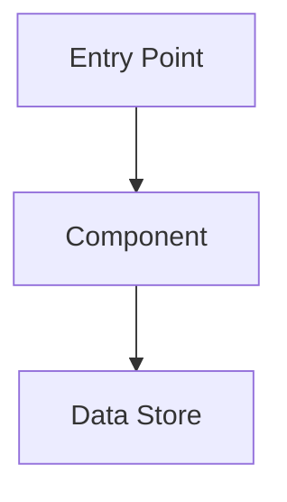
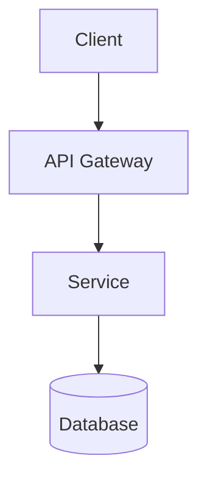
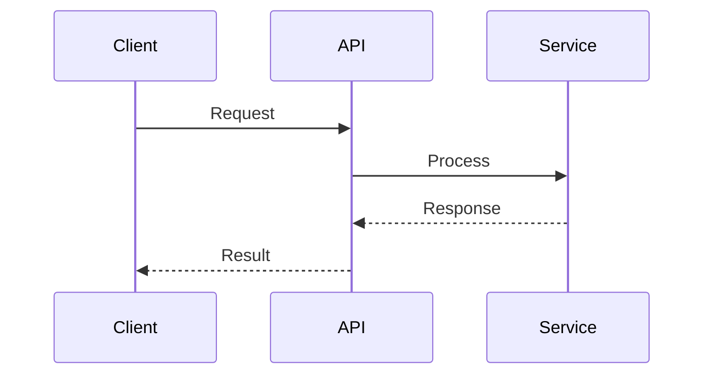

# Describe Design

Research a codebase and produce an architectural document describing how features or
systems work. The output is a markdown file organized for both human readers and
future AI agents.

## Workflow

### Stage 1: Scope Definition

Understand what to document before exploring:

1. Ask what feature, system, or component to document.
2. Clarify the target audience (developers, AI agents, or both).
3. Confirm the codebase location if not obvious from context.

### Stage 2: Initial Exploration

Use a haiku Explore subagent to scan the codebase broadly:

1. Scan directory structure and identify key entry points.
2. Read README, config files, and existing documentation.
3. Identify the main files and modules related to the feature.
4. Build a mental model of codebase organization.

Present a high-level outline to the user:

```
## Proposed Outline

1. [Component A] - Brief description
2. [Component B] - Brief description
3. [Component C] - Brief description

Does this capture the scope? Should I add or remove anything?
```

Wait for user confirmation before proceeding.

### Stage 3: Deep Research

For each component in the approved outline:

1. Trace code paths from entry points.
2. Identify dependencies and interactions between components.
3. Note configuration options and where they're defined.
4. Find where data is stored or persisted.
5. Build a code reference index (file paths + key function/class names).

### Stage 4: Document Draft

Generate the document following the template below. Present the draft to the user
for review and iterate based on feedback.

### Stage 5: Finalize

1. Ask the user where to save the file (if not already specified).
2. Write the final document to the specified location.

## Document Template

Use this structure for the output document:

````markdown
# [Feature/System Name] Architecture

## Overview

[1-2 paragraph summary of what this feature/system does and why it exists]

## Architecture Diagram



## Components

### [Component Name]

**Purpose**: [What it does]

**Location**: `path/to/file.ext`

**Key Functions**:
- `functionName()` - Brief description
- `anotherFunction()` - Brief description

**Interactions**:
- Receives input from: [Component]
- Sends output to: [Component]

## Data Flow

[Description of how data moves through the system, from input to output]

## Configuration

[How features are enabled, disabled, or configured. Include file paths and
environment variables.]

## Code References

| Component | File | Key Symbols |
|-----------|------|-------------|
| Auth | `src/auth/index.ts` | `authenticate()`, `AuthConfig` |
| Cache | `src/cache/redis.ts` | `CacheManager`, `invalidate()` |

## Glossary

| Term | Definition |
|------|------------|
| [Term] | [Project-specific definition] |
````

## Code Reference Conventions

Use stable references that survive refactoring:

- **Paths**: Use relative paths from repository root (`src/auth/login.ts`)
- **Symbols**: Reference function and class names, not line numbers
- **Format**: `path/to/file.ext` with key symbols listed separately
- **Anchors**: Use search patterns when helpful (`handleAuth function in auth/`)

Avoid:
- Absolute line numbers (change frequently)
- Copying large code blocks (summarize instead)
- Hardcoded absolute paths

## Mermaid Diagrams

Use Mermaid for architecture visualizations:

**Flowcharts** for component relationships:


**Sequence diagrams** for request flows:


Keep diagrams focused on the specific feature being documented. Avoid overcrowding
with unrelated components.

## Writing Guidelines

- **Summarize, don't copy**: Explain what code does rather than reproducing it.
- **Structure for scanning**: Use headers, tables, and lists for quick navigation.
- **Be specific**: Include actual file paths, function names, and config keys.
- **Serve two audiences**: Write clearly for humans; use consistent structure for AI.
- **Stay current**: Note any assumptions about code state or version.
